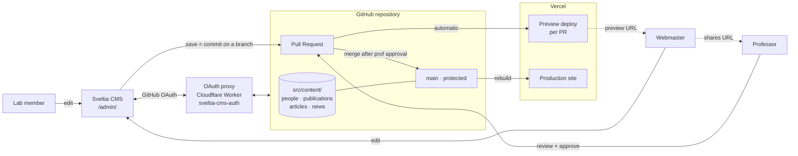

# LECS — Laboratory for Emerging Computing Systems

Astro v6 site for the [Laboratory for Emerging Computing Systems](https://sites.google.com/site/lebeux/)
at Concordia University, in the visual language of [concordia.ca](https://www.concordia.ca).

## Pages

- `/` — landing page (hero, about, research, people, news, publications, join)
- `/profile/[id]` — individual profile per person
- `/articles` — long-form research notes listing
- `/article/[slug]` — article detail
- `/publication/[slug]` — paper detail (IBM-research-style)
- `/admin/` — Sveltia CMS editor for lab members (git-backed, requires GitHub login)

French mirrors of every page live under `/fr/`.

## Editing content

Most content lives in Astro content collections, one file per entry:

| What            | Where                                  | Format |
| --------------- | -------------------------------------- | ------ |
| People profiles | `src/content/people/*.json`            | JSON   |
| Publications    | `src/content/publications/*.json`      | JSON   |
| Articles        | `src/content/articles/*.mdx`           | MDX    |
| News items      | `src/content/news/*.json`              | JSON   |
| Paper PDFs      | `public/papers/<basename>.pdf`         | PDF    |

Schemas are defined in [`src/content.config.ts`](src/content.config.ts) and
validated at build time by Zod.

Research areas, role labels, and lab metadata that change rarely still live
in [`src/data/lecs.ts`](src/data/lecs.ts).

The intended editing surface for lab members is the **CMS at `/admin/`** —
see [`docs/CMS.md`](docs/CMS.md) for the editor workflow and the one-time
infrastructure setup (GitHub OAuth App + Cloudflare Worker auth proxy +
branch protection).

## Architecture

The site is a static Astro build hosted on Vercel, with a git-backed CMS
layered on top. There is no application database and no server-side
runtime — the **GitHub repository is the content store**, and the
**pull-request flow is the approval mechanism**.

Boundaries worth knowing:

- The **CMS UI** runs entirely in the browser. There is no backend
  service to maintain. Sveltia speaks directly to the GitHub API.
- The **OAuth proxy** is the only piece of server-side infrastructure
  and exists solely because GitHub's OAuth flow requires a server-side
  callback. Cloudflare Workers free tier is sufficient.
- **Branch protection on `main`** is the real security boundary. The
  CMS's "Draft → In Review → Ready" workflow is editor convenience;
  it's GitHub that refuses to merge without the prof's approval.
- **Vercel previews** give a real, deployed URL for every PR — this is
  what the webmaster forwards to the professor for review, with no
  need for local checkouts or `npm run dev`.

## Commands

| Command            | Action                                       |
| ------------------ | -------------------------------------------- |
| `npm install`      | Install dependencies                         |
| `npm run dev`      | Local dev server at `localhost:4321`         |
| `npm run build`    | Build to `./dist/`                           |
| `npm run preview`  | Preview the production build locally         |

Responsive QA scripts under `scripts/` (Puppeteer-based) catch
horizontal-overflow regressions at widths 320–1440 px. The full test
plan is in [`docs/TESTING.md`](docs/TESTING.md).

## Stack

- [Astro 6](https://astro.build/) — static rendering with islands for the people / publications filters
- [`@astrojs/mdx`](https://docs.astro.build/en/guides/integrations-guide/mdx/) — MDX for long-form articles
- `astro:assets` — responsive WebP for the hero photo
- [`@vercel/analytics`](https://vercel.com/docs/analytics) — page-view analytics on Vercel
- [Sveltia CMS](https://github.com/sveltia/sveltia-cms) — git-backed editor at `/admin/`
- Plain CSS in `src/styles/global.css` (no framework) — Concordia maroon `#912338`, Inter for body, Gill Sans for accents

Hero photograph: silicon wafer macro by [Laura Ockel](https://unsplash.com/@viazavier), via Unsplash.
